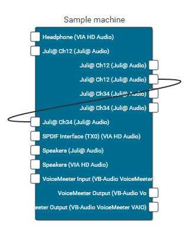
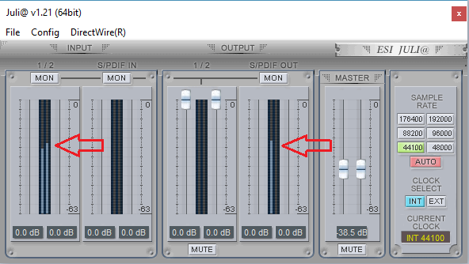
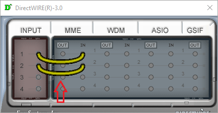

Troubleshooting
===============

Only one channel is transmitted
^^^^^^^^^^^^^^^^^^^^^^^^^^^^^^^

Please check your sound card configuration. If it supports an option to route
individual channels between inputs and outputs, ensure that this setup is valid.
With some sound cards even peakmeters in the sound card monitoring tool will
show stereo input, but it does not mean that what is actually available to the
applications is a stereo unless routing is set up.

Such issue is known for ESI Juli@ soundcard. Consider the following example:

We have set up a loop link in the Patchbay:

so we should hear what is recorded on the *Juli@ Ch12* input on the
*Juli@ Ch34* output, routed through Electron servers. But what we actually get
by default is stripped to the left channel:

The resolution is to open DirectWire settings:

and link physical inputs with actual driver's inputs. Then it will properly
pass stereo data to connected applications.

We are unable to test all existing soundcards but we believe that similar
pattern can be present with other multichannel devices.

.. toctree::
   :maxdepth: 2
